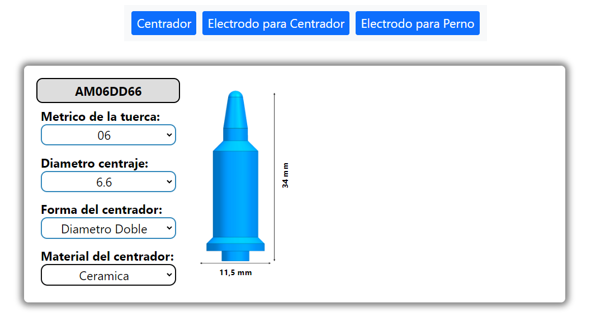

## Resumen

Este proyecto es una herramienta web diseñada para la empresa Tecsolda que permite a los usuarios seleccionar componentes de maquinaria de acuerdo a sus necesidades específicas.

- Repositorio: https://doplax.github.io/TSD-Centradores-Electrodos/

### Descripción General

La aplicación está pensada para que según los siguientes parámetros seleccionados:
- material 
- diámetro
- rosca
- forma 
- métrica 

La aplicación se encarga de actualizar automáticamente la información y las imágenes de los componentes, así como ajustar las cotas y referencias para proporcionar una visualización precisa del componente seleccionado. 

Se adapta dinámicamente a las decisiones del usuario, generando automáticamente opciones de diámetro y ajustando las opciones de métrica según la selección del usuario.

Este proyecto ya se encuentra en producción y está ayudando a mejorar la eficiencia y eficacia de las operaciones de Tecsolda.
- Página web de Tecsolda: https://tecsolda.com/electrodos-y-centradores-para-tuercas-y-tornillos/

